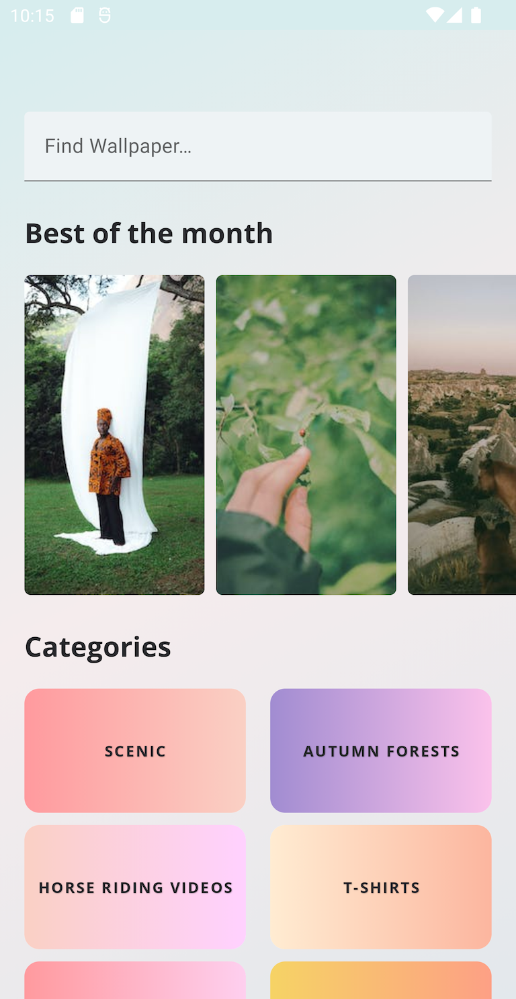
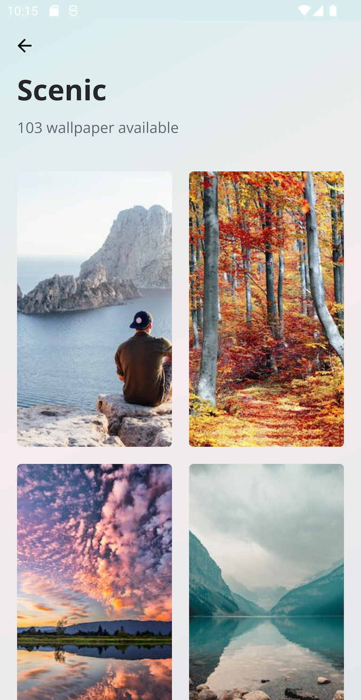

[](https://github.com/hientranea/Wallpaper/actions/workflows/android.yml)

# [Wallpapers](https://github.com/hientranea/Wallpaper)

This is an example of allowing users to change their wallpaper from various images. **Wallpaper** is also a complete app that demonstrates how to build an Android application using Uncle Bob's Clean Architecture approach.

The trick of the project is to demonstrate best practices, provide a set of guidelines, and present modern Android Application Architecture that is modular, maintainable, and testable, suitable for long application lifecycle management.

## :pushpin: Disclaimer

This app is only used for demonstration purpose since it's using the data source from [Pexel](https://www.pexels.com/api/).

## :tada: Ready on Google Play

Now, you can download it on Google Play Store. Install it and give me your feedback!

[](https://play.google.com/store/apps/details?id=com.hientran.wallpaper)

## :hammer: How to build app

- Using the newest version of Android Studio Dolphin.
- You must add `BASE_URL` and `PEXEL_API_KEY` inside `local.properties` to build and run Wallpapers app, like the code below:

    ```kotlin
    BASE_URL=https://api.pexels.com/v1/
    PEXEL_API_KEY=563492xxxxxx052975 // Please register [Pexel](https://www.pexels.com/) account and gain the API key.
    ```

## :camera: Screenshots
<p float="left">
  
  
  
</p>

## :blue_book: Built with
- A single-activity architecture, using Jetpack Navigation
- A presentation layer that contains a UI screen and a ViewModel per screen (or feature).
- Reactive UIs using Flow and coroutines for asynchronous operations.
- Dependency injection using Hilt.
- Apply TDD process with full unit tests and integration tests

## :mag_right: Testing

- Unit test
```
./gradlew testDebugUnitTest
```
- Integration test
```
./gradlew connectedDebugAndroidTest
```

## :bell: Notes

If you have any issues with the project, don't hesitate to create an issue. Also I'm glad you can contribute to my project.

## License

```
Copyright 2022 The Android Open Source Project

Licensed under the Apache License, Version 2.0 (the "License");
you may not use this file except in compliance with the License.
You may obtain a copy of the License at

    http://www.apache.org/licenses/LICENSE-2.0

Unless required by applicable law or agreed to in writing, software
distributed under the License is distributed on an "AS IS" BASIS,
WITHOUT WARRANTIES OR CONDITIONS OF ANY KIND, either express or implied.
See the License for the specific language governing permissions and
limitations under the License.
```
